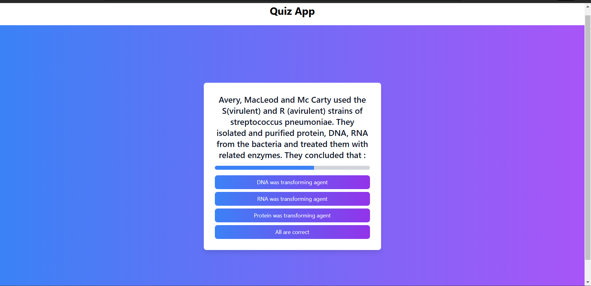
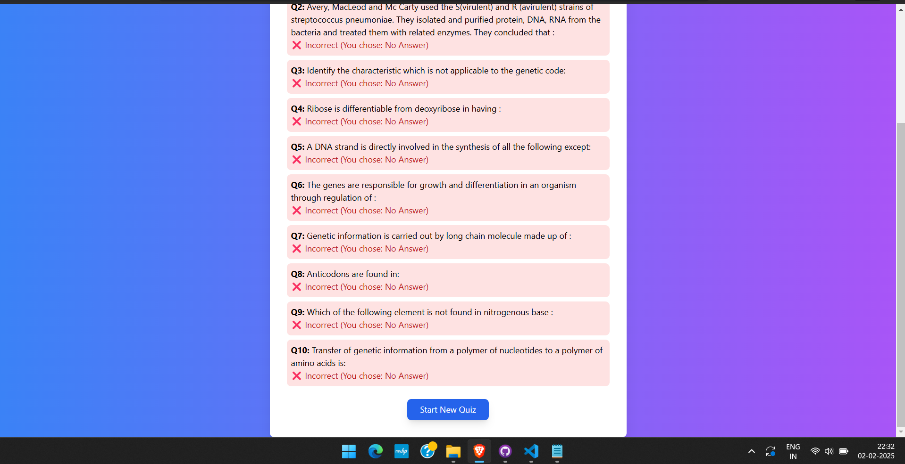

 
Quiz App

A simple quiz application built using "React (Vite)" with "Axios" for API calls and "Tailwind CSS" for styling and "Nodejs" for backend. 
The app fetches quiz questions from an API, limits the quiz to 10 questions, and provides a summary of the user's performance at the end.

🚀 Features

✅ Fetches quiz data from an API using Axios  
✅ Limits the quiz to 10 questions
✅ Implements a 10-second timer per question  
✅ Displays a score summary with correct & incorrect answers  
✅ Includes a restart button to start a new quiz  
✅ Uses Framer Motion for smooth animations  

📌 Tech Stack
- Frontend: React (Vite), Tailwind CSS, Framer Motion
- Backend: Node.js, JSON Server (or any REST API providing quiz data)

🛠 Setup Instructions

1️⃣ Clone the Repository

git clone https://github.com/YasirShaikh786/Quiz_app.git
cd quiz-app

2️⃣ Install Dependencies in both backend and frontend
npm install

3️⃣ Start the NODE.js server

node server.js

4️⃣ Start the React App

npm run dev

📌 Screen Shot

📌 Future Enhancements
- Add a leaderboard system
- Implement category-based quizzes
- Enhance UI animations & effects

📜 License
This project is open-source and free to use.

🔥 Enjoy your quiz game! Feel free to contribute or report issues. 😊

